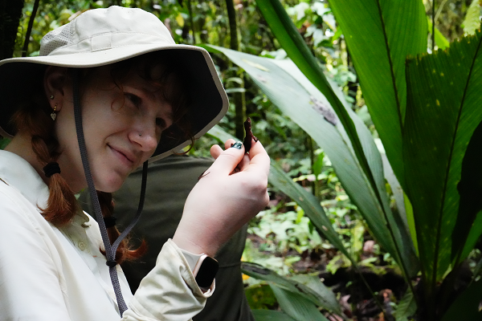

## About Me
I am a M.S student in the UConn EEB department interested in species response to climate change, symbiosis between species, sustainable agricultre, and conservation biology

[My CV](PDFs/cv.pdf)

[Contact Info](contact-info.md)

[UCONN EEB Department](https://eeb.uconn.edu/)
